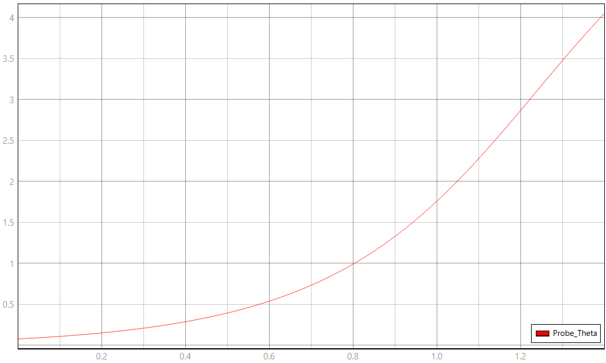

# Modelo TyphoonSim — Pêndulo Invertido (Equivalência Elétrica)

Este documento descreve o circuito elétrico equivalente implementado em `modelo.tse`, os
valores de cada elemento, a expressão do termo não linear, e o procedimento para rodar
cada um dos quatro ensaios definidos no relatório (`relatorio/relatorio.pdf`, Seção 10).

O circuito reproduz a equação do pêndulo invertido

```
J θ̈ = mgL sen(θ) − b θ̇ + τ(t)
```

por meio da analogia **torque–tensão**: tensão ↔ torque, corrente ↔ velocidade angular,
indutância ↔ momento de inércia, resistência ↔ atrito viscoso, carga ↔ ângulo.

## 1. Analogia eletromecânica

| Grandeza mecânica | Grandeza elétrica | Componente no `.tse` |
|---|---|---|
| Torque externo τ(t) | Fonte de tensão controlada v(t) | `Fonte_Torque_Ext` |
| Torque gravitacional mgL·sen(θ) | Fonte de tensão controlada, não linear | `Fonte_Torque_Gravidade` |
| Atrito viscoso b | Resistência R | `Amortecimento_b` |
| Momento de inércia J | Indutância L | `Inercia_J` |
| Velocidade angular ω = θ̇ | Corrente i | medida por `Velocidade_Angular_w` |
| Ângulo θ = ∫ω dt | Carga q = ∫i dt | saída de `Integrador_Theta` |

## 2. Topologia do circuito

O circuito é uma **malha série única**, fechada, na seguinte ordem:

```
Fonte_Torque_Ext.p ── Amortecimento_b.p
Amortecimento_b.n ── Velocidade_Angular_w.p
Velocidade_Angular_w.n ── Inercia_J.p
Inercia_J.n ── Fonte_Torque_Gravidade.n
Fonte_Torque_Gravidade.p ── Fonte_Torque_Ext.n   (fecha a malha)
```

Em paralelo à malha, o ramo de sinal que gera o termo não linear:

```
Velocidade_Angular_w.out ──► Integrador_Theta.in
Integrador_Theta.out ──► Junction1 ──► Seno_Theta.in
Seno_Theta.out ──► Ganho_Gravidade.in ──► Fonte_Torque_Gravidade.in
Junction1 ──► Probe_Theta.in
```

`Junction1` é o ponto onde o ângulo θ (saída do integrador) se divide em três destinos:
o `Seno_Theta` (para fechar a realimentação não linear), o `Probe_Theta` (para
visualização/captura) e nada mais — **é essencial que o probe esteja ligado aqui, na
saída do integrador, e não na saída do `Velocidade_Angular_w`** (esse último é ω, não
θ; os dois já foram trocados por engano em versões anteriores do modelo).

## 3. Valores dos elementos

| Elemento | Parâmetro | Valor | Corresponde a |
|---|---|---|---|
| `Amortecimento_b` | `resistance` | 0,05 Ω | b = 0,050 N·m·s/rad |
| `Inercia_J` | `inductance` | 0,50 H | J = mL² = 0,50 kg·m² |
| `Ganho_Gravidade` | `gain` | 4,905 | K = mgL = 0,5 × 9,81 × 1,0 |
| `Degrau_Torque` | `final_value` | varia por ensaio (ver Seção 5) | τ(t) |

Parâmetros físicos de referência: m = 0,50 kg, L = 1,00 m, g = 9,81 m/s².

## 4. Expressão do elemento não linear

O torque gravitacional é implementado em dois blocos em série:

```
Seno_Theta:      saída = sen(θ)            [core/Trigonometric function, sin, radianos]
Ganho_Gravidade: saída = K · sen(θ)        [core/Gain, K = 4,905]
```

O resultado, `K·sen(θ)`, controla `Fonte_Torque_Gravidade`, que injeta esse valor como
tensão na malha — fisicamente, o torque gravitacional desestabilizante mgL·sen(θ).

**Verificação de sinal:** a polaridade das duas fontes controladas (`Fonte_Torque_Ext` e
`Fonte_Torque_Gravidade`) e a ordem dos nós na malha foram conferidas analiticamente via
Lei de Kirchhoff das Tensões, resultando em

```
L·(dω/dt) = τ_ext(t) + K·sen(θ) − b·ω
```

que corresponde exatamente à equação do modelo com sinal desestabilizante correto.
Essa conferência foi validada numericamente: a integração independente da equação não
linear (Python/SciPy, mesmos parâmetros) reproduz os valores de θ(t) e ω(t) capturados
do TyphoonSim com 4–5 casas decimais de concordância.

## 5. Como executar cada ensaio

Antes de cada execução, **confira os valores ao vivo no painel do SCADA** — vários
parâmetros deste modelo são tunáveis e podem divergir do que está salvo no `.tse` se
foram ajustados numa sessão anterior. Os dois pontos mais sensíveis:

- `Integrador_Theta` → condição inicial de θ (`init_value`)
- `Inercia_J` → condição inicial de ω (`initial_current`)

| Ensaio | θ(0) (`Integrador_Theta`) | ω(0) (`Inercia_J.initial_current`) | τ(t) (`Degrau_Torque`) | Duração |
|---|---|---|---|---|
| **Degrau** | 0,02 rad | 0 | degrau de 0,05 N·m em t=0 (`final_value=0.05`, `step_time=0`) | ≈1,4 s |
| **Condição inicial não nula** | 0,30 rad | 0 | τ=0 (`final_value=0`) | 0,6 s |
| **Pulso temporário** | 0 | 0 | pulso de 0,15 N·m entre t=0,5 s e t=0,8 s* | ≈2,0 s |
| **Perturbação livre pequena** | 0,02 rad | 0 | τ=0 (`final_value=0`) | ≈1,4 s |

\* O bloco `Degrau_Torque` (`core/Step`) implementa um degrau único. Para o pulso, substitua
temporariamente por dois degraus somados (um de +0,15 N·m em t=0,5 s e outro de −0,15 N·m
em t=0,8 s) ou por um bloco `core/Pulse`, mantendo `final_value` do primeiro degrau em 0,05→0
conforme o ensaio.

**Procedimento, para cada ensaio:**
1. Ajustar `Integrador_Theta` e `Inercia_J.initial_current` conforme a tabela.
2. Ajustar `Degrau_Torque` (ou o bloco de pulso) conforme a tabela.
3. Carregar o modelo no HIL (Load model) e só depois iniciar a simulação (Start simulation).
4. Iniciar a captura no Capture **depois** da simulação já estar rodando, em modo
   free-run (sem trigger de evento), amostrando em torno de 10 kHz — não o passo
   interno do solver (ver nota abaixo).
5. Confirmar no `Probe_Theta` que o valor em t=0 bate com o θ(0) esperado antes de
   salvar a captura.

**Nota sobre taxa de amostragem:** o passo máximo de simulação (`max_sim_step`) é
1×10⁻⁴ s; não há necessidade de capturar em passo menor que esse. Um log com passo de
2×10⁻⁷ s (como os CSVs intermediários gerados durante os testes) produz arquivos de
centenas de MB sem ganho de informação — prefira decimar a captura para ~10 kHz.

## 6. Leitura esperada (referência de validação)

Para o ensaio **degrau** (θ(0)=0,02, ω(0)=0, τ=0,05 N·m), os valores de referência,
obtidos por integração numérica independente do modelo não linear, são:

| t (s) | θ (rad) | ω (rad/s) |
|---|---|---|
| 0,2 | 0,026 | 0,063 |
| 0,6 | 0,090 | 0,293 |
| 1,0 | 0,324 | 1,023 |
| 1,2 | 0,605 | 1,867 |
| 1,4 | 1,109 | 3,274 |

θ cruza o domínio de validade (±0,60 rad) em aproximadamente **t = 1,20 s** — esse é o
critério prático mais rápido para confirmar, visualmente, que a captura do ensaio degrau
está correta antes de salvar `captura-scada.png`.

## 7. Captura do SCADA

A captura deve mostrar, numa única imagem: o esquemático montado (Seção 2) e o painel
SCADA em execução, com o gráfico de `Probe_Theta` visível e os valores dos instrumentos
virtuais (θ instantâneo, e os parâmetros tunáveis da Seção 5) legíveis. O ensaio
capturado é o **degrau**, por ser o caso de referência usado também no relatório
(Figura 3).

## Captura de tela (esquemático + painel SCADA)

