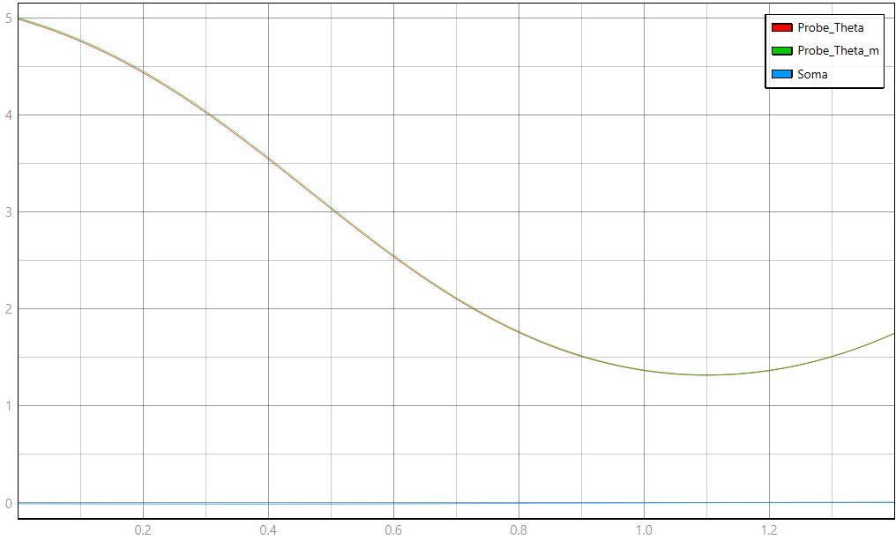

# Modelo TyphoonSim — Realimentação Negativa na Instrumentação do Pêndulo Invertido

Este documento descreve o circuito elétrico equivalente implementado em `modelo.tse`
para esta etapa, os valores de cada elemento, a expressão dos elementos não lineares,
e o procedimento para rodar o ensaio principal (Seções 13–14 do relatório) e capturar
o resultado.

Este modelo reaproveita a planta (pêndulo invertido) já validada na entrega anterior e
adiciona, em paralelo, o **instrumento de medição com realimentação negativa interna**
descrito nas Seções 4–6 do relatório: o ângulo real θ da planta passa a ser a entrada
de um canal de medição que produz uma indicação θₘ, por meio de

```
e_i = θ − Im·θm
θm = A·e_i
```

## 1. Analogia eletromecânica (planta — reaproveitada da entrega anterior)

| Grandeza mecânica | Grandeza elétrica | Componente no `.tse` |
|---|---|---|
| Torque externo τ(t) | Fonte de tensão controlada v(t) | `Fonte_Torque_Ext` |
| Torque gravitacional mgL·sen(θ) | Fonte de tensão controlada, não linear | `Fonte_Torque_Gravidade` |
| Atrito viscoso b | Resistência R | `Amortecimento_b` |
| Momento de inércia J | Indutância L | `Inercia_J` |
| Velocidade angular ω = θ̇ | Corrente i | medida por `Velocidade_Angular_w` |
| Ângulo θ = ∫ω dt | Carga q = ∫i dt | saída de `Integrador_Theta` (Junction1/Junction3) |

## 2. Analogia do instrumento (nova nesta etapa)

| Grandeza do instrumento | Símbolo | Componente no `.tse` |
|---|---|---|
| Entrada do instrumento (θ real) | θ | `Junction3`, alimentado por `Junction1` |
| Erro interno | e_i | saída de `Sum1` (`Junction4`) |
| Ganho direto (amplificador de alto ganho) | A | `Ganho_A` |
| Filtro de banda (quebra o laço algébrico) | — | `FT` |
| Ganho/característica do sensor | Ks | `Sensor_Ks` (tunável) |
| Indicação (saída do instrumento) | θm | `Junction2`, medido por `Probe_Theta_m` |
| Caminho de realimentação | Im | `Realimentacao_Im` |

## 3. Topologia do circuito

**Malha da planta** (reaproveitada, sem alterações — ver `instrucoes.md` da entrega
anterior para o detalhamento completo desta parte):

```
Fonte_Torque_Ext.p ── Amortecimento_b.p
Amortecimento_b.n ── Velocidade_Angular_w.p
Velocidade_Angular_w.n ── Inercia_J.p
Inercia_J.n ── Fonte_Torque_Gravidade.n
Fonte_Torque_Gravidade.p ── Fonte_Torque_Ext.n
```

**Malha do instrumento** (nova), em sinal (não em potência — são todos blocos de
processamento de sinal, não componentes elétricos):

```
Junction1 (θ) ──► Junction3 ──► Sum1.in
Realimentacao_Im.out ──► Sum1.in1          (sinais "+-": e_i = θ − Im·θm)
Sum1.out ──► Junction4 (e_i) ──► Ganho_A.in
Ganho_A.out ──► FT.in                      (quebra o laço algébrico — ver Seção 5)
FT.out ──► Sensor_Ks.in
Sensor_Ks.out ──► Junction2 (θm)
Junction2 ──► Realimentacao_Im.in          (fecha a malha)
```

Probes conectados: `Probe_Theta` em `Junction3` (θ), `Soma` em `Junction4` (e_i),
`Probe_Theta_m` em `Junction2` (θm) — os três sinais que o relatório pede na Seção 12.

**Importante:** a malha do instrumento lê θ da planta, mas não realimenta nada de volta
para ela — não há conexão de `Sensor_Ks`, `Realimentacao_Im` ou qualquer probe de volta
para `Fonte_Torque_Ext` ou `Fonte_Torque_Gravidade`. Isso é proposital: conforme a
Seção 5 do relatório, esta realimentação atua só no canal de medição, não na dinâmica
mecânica do pêndulo. A malha PD de controle da planta (Seções 7–9 do relatório) não
está implementada neste modelo — é tratada no relatório como aplicação complementar,
fora do escopo desta captura.

## 4. Valores dos elementos

| Elemento | Parâmetro | Valor | Observação |
|---|---|---|---|
| `Amortecimento_b` | `resistance` | 0,05 Ω | b = 0,050 N·m·s/rad |
| `Inercia_J` | `inductance` | 0,50 H | J = mL² = 0,50 kg·m² |
| `Ganho_Gravidade` | `gain` | 4,905 | K = mgL |
| `Degrau_Torque` | `final_value` / `step_time` | 0,05 N·m / t=0 | τ(t), ensaio degrau |
| `Ganho_A` | `gain` | 5000 | A — ganho direto do amplificador |
| `Sensor_Ks` | `gain` (tunável) | 1,0 nominal | Ks — ajustar para Ks0+ΔKs no ensaio |
| `Realimentacao_Im` | `gain` | 1,0 (padrão do bloco, sem override) | Im — ver nota na Seção 6 |
| `FT` | `a_coeff` / `b_coeff` / `domain` | `[1,-0.9]` / `[0,0.1]` / **`Z-domain`** | filtro PT1 discreto, τ≈1 ms (ver abaixo) |

Parâmetros físicos de referência: m = 0,50 kg, L = 1,00 m, g = 9,81 m/s².

## 5. Expressão dos elementos não lineares / auxiliares

**Termo gravitacional (planta, reaproveitado):**

```
Seno_Theta:      saída = sen(θ)
Ganho_Gravidade: saída = K · sen(θ) = 4,905 · sen(θ)
```

**Filtro `FT` — não é uma não linearidade física, é um artifício numérico.** A malha
`Sum1 → Ganho_A → Sensor_Ks → Realimentacao_Im → Sum1` é formada só por blocos
algébricos (sem nenhum elemento com memória), o que gera um laço algébrico que o
solver não consegue resolver. O bloco `FT` insere um polo rápido nessa malha para
quebrar o laço, representando fisicamente a banda finita do estágio de amplificação —
um amplificador real nunca tem banda infinita, então isso não é uma idealização
artificial, é inclusive mais realista que um ganho puro.

Os coeficientes implementam, em Z-domínio (Euler, Tₛ = 100 µs, τ = 1 ms):

```
x[n] = 0,9·x[n−1] + 0,1·u[n−1]
```

ou seja, $H(z)=\dfrac{0{,}1\,z^{-1}}{1-0{,}9\,z^{-1}}$ — polo em z=0,9 (estável, dentro
do círculo unitário), sem transmissão direta (b_coeff começa em 0). A constante de
tempo efetiva é ≈0,95 ms — cerca de 300× mais rápida que o polo instável da planta
(λ₁≈3,08 rad/s), então o filtro se estabiliza antes de qualquer leitura relevante e
não altera os resultados de regime calculados na Seção 7.

## 6. Como executar o ensaio principal (Seções 13–14 do relatório)

O objetivo é comparar a sensibilidade da indicação θm a uma variação ΔKs do sensor,
com e sem a realimentação. Como `Realimentacao_Im` não está marcado como tunável neste
modelo, alternar entre malha aberta (Im=0) e malha fechada (Im=1) exige editar o valor
de `gain` em `Realimentacao_Im` e recompilar entre as execuções 1–2 e 3–4 abaixo (ou
marcar `_tunable="True"` nesse bloco antes de começar, se quiser fazer isso pelo painel).

Valores adotados para o ensaio (não constavam, numericamente, no relatório — foram
fixados para esta execução; documentem isso no texto):

| Execução | `Realimentacao_Im.gain` | `Sensor_Ks` (painel SCADA) | θm/θ esperado |
|---|---|---|---|
| 1 — aberta, nominal | 0 | 1,0 | 5000 |
| 2 — aberta, com desvio | 0 | 1,1 | 5500 |
| 3 — fechada, nominal | 1 | 1,0 | 0,999800 |
| 4 — fechada, com desvio | 1 | 1,1 | 0,999818 |

**Procedimento, para cada execução:**
1. Ajustar `Realimentacao_Im.gain` (0 ou 1) — exige recompilar, já que não é tunável.
2. Ajustar `Sensor_Ks` no painel do SCADA (1,0 ou 1,1).
3. Confirmar no painel que `Integrador_Theta` e `Inercia_J.initial_current` estão
   zerados (θ(0)=0, ω(0)=0) — ambos já são o padrão do modelo, mas confira ao vivo,
   já que parâmetros tunáveis podem divergir do `.tse` salvo se foram ajustados numa
   sessão anterior (já aconteceu duas vezes nesta disciplina).
4. Carregar o modelo, iniciar a simulação, e só então iniciar a captura (free-run,
   sem trigger), amostrando em torno de 10 kHz.
5. Ler θ, θm e e_i (Soma) no instante t = 0,3 s (ver tabela de referência abaixo).
6. Repetir para as 4 execuções e calcular a sensibilidade S (relatório, Seção 13,
   passo 10) para o caso aberto e o caso fechado.

## 7. Leitura esperada — referência de validação

Para a execução 3 (malha fechada, Ks nominal = 1,0, degrau τ=0,05 N·m, θ(0)=ω(0)=0),
valores de referência obtidos por integração numérica independente da planta, com a
razão algébrica do instrumento (θm/θ ≈ 0,9998) aplicada:

| t (s) | θ (rad) | θm (rad) | e_i = Soma (rad) |
|---|---|---|---|
| 0,2 | 0,002052 | 0,002052 | 0,00000041 |
| 0,3 | 0,004792 | 0,004791 | 0,00000096 |
| 0,6 | 0,023465 | 0,023460 | 0,0000047 |
| 1,0 | 0,102948 | 0,102928 | 0,0000206 |
| 1,2 | 0,199011 | 0,198971 | 0,0000398 |

**O que observar:** θ e θm devem ficar praticamente sobrepostas no scope (diferença
relativa de ordem 10⁻⁴, invisível na escala normal) — isso é o resultado esperado, não
falha de captura. O sinal `Soma` (e_i) vai aparecer achatado perto de zero na mesma
escala; para mostrá-lo de forma legível, use um eixo Y próprio, bem mais sensível.

Para o contraste entre malha aberta e fechada (execuções 1–4), a comparação não é no
formato do gráfico, e sim na tabela de sensibilidade: em malha aberta, θm varia 10,0%
entre as execuções 1 e 2 (S≈1, sem atenuação); em malha fechada, θm varia ≈0,0018%
entre as execuções 3 e 4 (S≈1,8×10⁻⁴) — cerca de 5500× menor, demonstrando a redução de
sensibilidade prevista na Seção 6 do relatório.

## Captura de tela (esquemático + painel SCADA)

