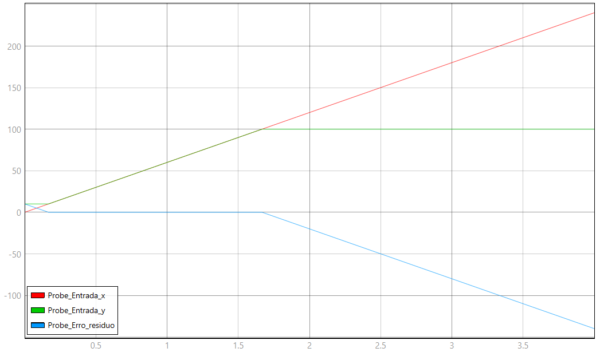

# Instruções --- Ensaio de Linearidade Estática e Saturação

## 1. Topologia do circuito

O circuito foi montado no TyphoonSim para avaliar a linearidade estática
de um instrumento com saturação nas extremidades da faixa de operação.

A topologia utilizada é:

``` text
                         ┌───────────┐
                         │  Gain1    │
                         │    = 1    │
                         └─────┬─────┘
                               │
                               ▼
Entrada x ──► Probe_Entrada_x ──► C function1 ──► Probe_Entrada_y
   │                           │
   │                           │
   └────────► Gain2 = 1 ──► Sum1 (+) ──► Sum2 (+)
                           ▲                  ▲
                           │                  │
                     Constant1 = 0            │
                                              │
                         C function1.out ─────┘
                              Sum2 (+, −)
                                  │
                                  ▼
                         Probe_Erro_residuo
```

De forma resumida:

1.  `Entrada_x` gera a grandeza de entrada `x`.
2.  O sinal é monitorado por `Probe_Entrada_x`.
3.  O sinal segue pelo `Gain1`, com ganho unitário.
4.  A saída do `Gain1` entra na `C function1`, que representa o
    instrumento não linear com saturação.
5.  A saída da `C function1` é monitorada por `Probe_Entrada_y`.
6.  Em paralelo, a entrada passa por `Gain2`, também com ganho unitário,
    formando a saída ideal de referência.
7.  `Constant1` possui valor zero e é somado à referência em `Sum1`.
8.  `Sum2` calcula o resíduo entre a saída real e a saída ideal.
9.  O resultado é monitorado por `Probe_Erro_residuo`.

A lógica do cálculo do erro é, portanto:

``` text
y_ideal = x

erro = y_real − y_ideal
```

Essa estrutura corresponde à metodologia descrita no relatório, na qual
a saída real do sensor é comparada com uma referência ideal para obter o
erro residual. O relatório também indica que o desvio máximo deve ser
observado nas regiões de saturação.

## 2. Valores dos elementos

  Elemento        Parâmetro                 Valor
  --------------- -------------- ----------------
  `Entrada_x`     Slope                      `60`
  `Entrada_x`     Start time                `2 s`
  `Gain1`         Ganho                       `1`
  `Gain2`         Ganho                       `1`
  `Constant1`     Valor                       `0`
  `Sum1`          Operação                  `+ +`
  `Sum2`          Operação                  `+ −`
  `C function1`   Faixa linear     `10 ≤ x ≤ 100`

Os três instrumentos virtuais utilizados para monitoramento são:

-   `Probe_Entrada_x`: valor da entrada `x`;
-   `Probe_Entrada_y`: valor da saída real `y`;
-   `Probe_Erro_residuo`: diferença entre a saída real e a referência
    ideal.

## 3. Expressão do elemento não linear

O comportamento não linear está implementado na `C function1`.

A expressão utilizada é:

``` c
if (in > 100.0) {
    out = 100.0; // Saturação superior
} else if (in < 10.0) {
    out = 10.0;  // Saturação inferior
} else {
    out = in;    // Região estritamente linear
}
```

Em forma matemática:

\[ y =
```{=tex}
\begin{cases}
10, & x < 10 \\
x, & 10 \leq x \leq 100 \\
100, & x > 100
\end{cases}
```
\]

Assim, o instrumento apresenta comportamento linear somente entre 10 e
100. Fora dessa faixa, a saída permanece limitada aos valores de
saturação.

## 4. Como executar o ensaio

### 4.1. Preparação

1.  Abra o arquivo `modelo.tse` no TyphoonSim.
2.  Confira se todos os blocos estão conectados conforme a topologia
    apresentada neste documento.
3.  Verifique se os valores de `Gain1`, `Gain2`, `Constant1` e
    `Entrada_x` estão configurados conforme a tabela da seção 2.
4.  Confira o código da `C function1`, principalmente os limites de
    saturação `10` e `100`.
5.  Abra o painel de instrumentação/SCADA utilizado para visualizar os
    três sinais.

### 4.2. Execução

1.  Inicie a simulação.
2.  Aguarde a entrada `Entrada_x` iniciar a rampa no instante `t = 2 s`.
3.  A rampa deve variar com inclinação `60`.
4.  Observe simultaneamente:
    -   `Probe_Entrada_x`;
    -   `Probe_Entrada_y`;
    -   `Probe_Erro_residuo`.
5.  Durante a região em que a entrada está entre `10` e `100`, a saída
    real deve acompanhar a entrada ideal.
6.  Quando a entrada ultrapassar `100`, a saída real deve permanecer
    limitada em `100`.
7.  Quando a entrada estiver abaixo de `10`, a saída real deve
    permanecer limitada em `10`.
8.  O `Probe_Erro_residuo` deve evidenciar a diferença entre a saída
    real saturada e a referência ideal.

### 4.3. Verificação dos resultados

Para cada instante, considere:

``` text
y_ideal = x
erro = y_real − y_ideal
```

O maior valor absoluto do erro deve ser utilizado para identificar o
maior desvio provocado pela saturação.

O relatório descreve essa metodologia como a comparação entre a saída
real do sensor e a reta estimada/ideal, com monitoramento do resíduo e
identificação do desvio máximo nas regiões de saturação.
fileciteturn0file0L139-L157

## Captura de tela (esquemático + painel SCADA)


