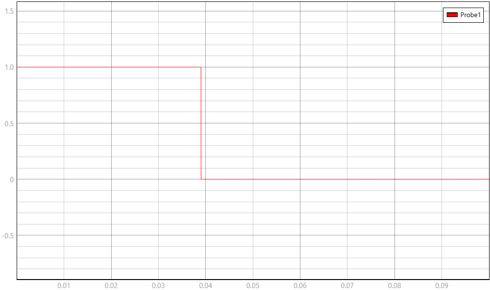

# Modelo TyphoonSim — Transformada de Fourier (pulso retangular isolado)

Este documento descreve o modelo implementado em `modelo.tse`, os valores do sinal
gerado e o procedimento para capturar o pulso e processá-lo em FFT (Anexo A do
relatório).

## 1. Topologia do circuito

```
Step1 [degrau +1 em t=0]  ──┐
                             ├─► Sum1 (soma) → Probe1
Step2 [degrau −1 em t=τ]  ──┘
```

Um pulso retangular isolado é construído como a soma de dois degraus: um degrau
positivo em t=0 que "liga" o sinal, e um degrau negativo de mesma amplitude em t=τ que
"desliga" — a soma dos dois produz um pulso de amplitude A e largura τ, sem precisar de
um bloco de pulso dedicado.

## 2. Valores dos elementos

| Elemento | Parâmetro | Valor |
|---|---|---|
| `Step1` | `step_time` | **0 s** (corrigir — ver aviso acima) |
| `Step1` | `final_value` | 1 (padrão, não sobrescrito) |
| `Step2` | `step_time` | 0,05 s (= t₀ + τ) |
| `Step2` | `final_value` | −1 |

Resultando em: amplitude A = 1, largura τ = 0,05 s, instante de disparo t₀ = 0 s —
exatamente os valores declarados na Seção 6.1 do relatório.

## 3. Como executar a captura

1. Configurar a captura para `fs = 5 MHz`, `N = 5.000.000` amostras — resultando em
   uma janela de `T_janela = 1 s`. Esses são os parâmetros já usados na captura
   inserida no relatório (Seção 7.2) e que batem com a teoria.
2. Rodar a simulação e confirmar visualmente que o pulso aparece entre t=0 e t=0,05 s,
   sem cortar nas bordas da janela (ver Seção 6.2 do relatório — cuidados para a
   captura).
3. Exportar `Time` e `Probe1` para CSV (nome usado no script do Anexo A:
   `pulso_typhoonsim.csv` — ajustar o nome no script se exportar com outro).
4. Rodar o script do Anexo A para calcular N, Δf, f_N, aplicar a FFT e comparar com a
   solução analítica $A\tau\,\text{sinc}(f\tau)$.

## 4. Leitura esperada — referência de validação

| Grandeza | Valor esperado |
|---|---|
| Δf = fs/N | 1 Hz |
| f_N = fs/2 | **2,5 MHz** (não 5 kHz — ver correção na Seção 6.1 do relatório) |
| Primeiro zero do espectro | ±20 Hz (= 1/τ) |
| \|X(0)\| teórico | A·τ = 0,05 |

Se a FFT exportada bater com esses quatro números (em especial o primeiro zero em
±20 Hz e o valor em 0 Hz = 0,05), a captura está consistente com a teoria da Seção 3
do relatório.

## Captura de tela (esquemático + painel SCADA)

