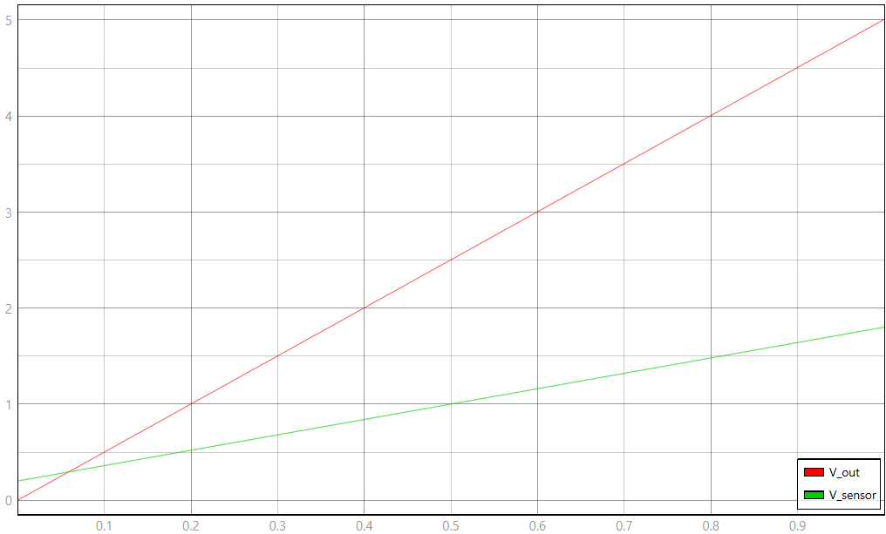

# Modelo TyphoonSim — Cadeia Ideal (DRV5053 + Amplificador Diferencial)

Este documento descreve o modelo implementado em `modelo.tse`, os valores de cada
elemento, a equação do sensor ideal e o procedimento para rodar e capturar o ensaio
único desta entrega (R4–R5).

## 1. Topologia do circuito

```
Campo (B) [Ramp: −17,8 → +17,8 mT em 1 s]
  → Sensibilidade (S) [Gain 0,045]  ─┐
                                      ├─► Sum1 (Vq + S·B) → Junction1 → V_sensor
Tensão de Repouso (Vq) [Constant=1] ─┘

Junction1 → Sum2.in
V_ref (0,2) → Sum2.in1
Sum2 (sinais "+-"): V_sensor − V_ref → Ad (3,125) → V_out
```

Esta é a cadeia inteira: sensor ideal (Ramp + Gain + Sum1) seguido do amplificador
diferencial (Sum2 + Ad), sem nenhuma camada de não idealidade — essa parte fica para
a Entrega 02.

## 2. Valores dos elementos

| Elemento | Parâmetro | Valor | Corresponde a |
|---|---|---|---|
| `Campo (B)` | `initial_output` / `slope` | −17,8 / 35,6 | varredura de B, −17,8 a +17,8 mT em 1 s |
| `Tensão de Repouso (Vq)` | valor (padrão, sem override) | 1,0 V | VQ do DRV5053 |
| `Sensibilidade (S)` | `gain` | 0,045 V/mT | S = 45 mV/mT |
| `V_ref` | valor | 0,2 V | VOUT,min do sensor — piso da excursão |
| `Ad` | `gain` | 3,125 | ganho do amplificador diferencial, R2/R1=R4/R3 |

Nenhum componente deste modelo está marcado como tunável (`_tunable="False"` em
todos) — isso é proposital, para evitar o problema de parâmetro divergente entre o
`.tse` salvo e o que é executado ao vivo no SCADA, que já aconteceu nas primeiras
tentativas desta entrega.

## 3. Equação do sensor ideal

```
V_sensor = VQ + S · B = 1,0 + 0,045 · B
```

Implementada diretamente por `Tensão de Repouso (Vq)` + `Sensibilidade (S)` somados em
`Sum1` — não há não linearidade nem efeito de saturação modelado aqui (isso também
fica para a Entrega 02); o sensor "ideal" é só essa reta.

## 4. Como executar o ensaio

Há um único ensaio nesta entrega: a varredura completa de B.

1. Carregar o modelo (nenhum parâmetro precisa de ajuste — não há tunáveis).
2. Iniciar a simulação (1 s de duração) e, em seguida, iniciar a captura no Capture,
   em modo free-run, amostrando em torno de 10 kHz (não é preciso capturar no passo
   interno de 1×10⁻⁴ s — gera arquivo grande sem ganho de informação).
3. Capturar `V_sensor` e `V_out` por toda a duração da simulação.

## 5. Leitura esperada — referência de validação

Valores já confirmados por dois logs HIL reais nesta disciplina:

| t (s) | B (mT) | V_sensor (V) | V_out (V) |
|---|---|---|---|
| 0,0 | −17,8 | 0,199 | ≈0 (−0,003) |
| 0,5 | 0,0 | 1,000 | 2,500 |
| 1,0 | +17,8 | 1,801 | ≈5,00 (5,003) |

A relação entre as duas colunas finais é sempre $V_{out}=3{,}125\cdot(V_{sensor}-0{,}2)$,
em qualquer ponto da varredura. A faixa de saída obtida (−0,003 V a 5,003 V) excede os
limites nominais em menos de 3,1 mV — erro de ≈0,06% do fundo de escala, bem abaixo do
limite de 2% da especificação.

## Captura de tela (esquemático + painel SCADA)

