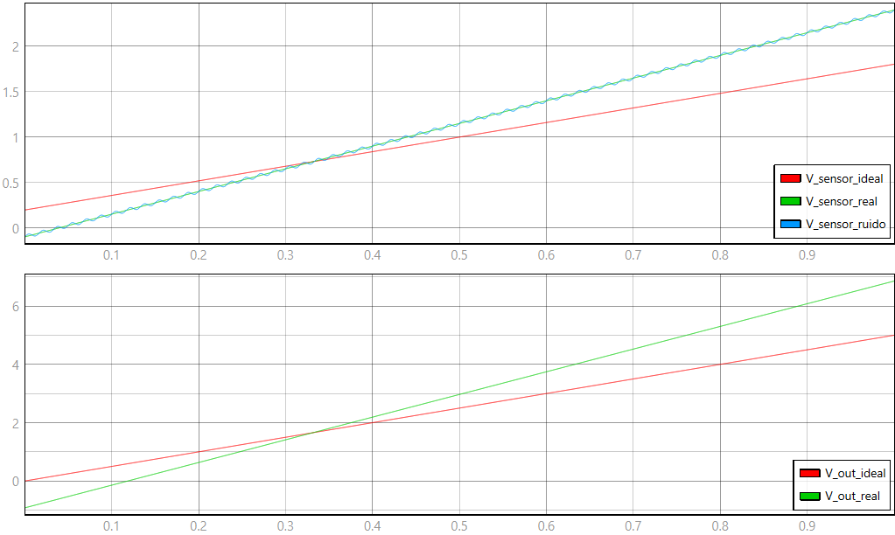

# Modelo TyphoonSim — Não Idealidades do Sensor (DRV5053 + Amplificador Diferencial)

Este documento descreve o modelo implementado em `modelo.tse`, os valores de cada
elemento, a expressão das três camadas de não idealidade e o procedimento para rodar
cada captura necessária ao relatório (R6–R10).

O modelo contém **duas cadeias em paralelo**: a cadeia **ideal** (idêntica à da
Entrega 01, usada como referência) e a cadeia **real/degradada** (sensor com desvio
estático + ruído espectral, processado pelo mesmo amplificador diferencial).

## 1. Topologia do circuito

**Cadeia ideal (referência, Entrega 01 — sem alterações):**

```
Campo (B) [Ramp: −17,8 → +17,8 em 1 s]
  → Sensibilidade (S) [Gain 0,045]  ─┐
                                      ├─► Sum1 (Vq + S·B) → Junction1 → V_sensor_ideal
Tensão de Repouso (Vq) [Constant=1] ─┘
Junction1 → Sum5 (−V_ref1=0,2) → Ad1 (3,125) → V_out_ideal
```

**Cadeia real (camada estática, via C function):**

```
Campo (B) → "C function1" (equação da Seção 2) → Junction3 → V_sensor_real
```

**Injeção do ruído de 60 Hz, em modo comum (camada espectral):**

```
Gerador de Ruído [Sinusoidal: 0,02 V, 60 Hz] → Junction2
Junction2 ─┬─► Sum4 (+ V_sensor_real) → Junction4 → V_sensor_ruido
           └─► Sum3 (+ V_ref)         → Sum2.in1
Junction4 → Sum2.in
Sum2 (V_sensor_real+ruído) − (V_ref+ruído) → Ad (3,125) → V_out_real
```

O ruído entra **duas vezes com o mesmo valor** (uma vez somado ao sinal do sensor, outra
somado à referência) e se cancela na subtração de `Sum2` — é essa simetria que
demonstra, na prática, por que o amplificador diferencial rejeita modo comum (R8/R10).

Não há camada dinâmica implementada como bloco: a ordem zero (R7) é representada pela
**ausência** de qualquer atraso ou função de transferência na cadeia real — a saída
acompanha a entrada no mesmo passo de simulação.

## 2. Valores dos elementos

| Elemento | Parâmetro | Valor |
|---|---|---|
| `Campo (B)` / `Campo (B)1` | `initial_output` / `slope` | −17,8 / 35,6 (mesma varredura nas duas cadeias) |
| `Tensão de Repouso (Vq)` | valor (padrão) | 1,0 V |
| `Sensibilidade (S)` | `gain` | 0,045 V/mT |
| `V_ref` / `V_ref1` | valor | 0,2 V |
| `Ad` / `Ad1` | `gain` | 3,125 |
| `Gerador de Ruído` | `amplitude` / `frequency` | 0,02 V / 60 Hz |
| `C function1` | `VQ_nominal` / `S_nominal` | 1,0 V / 0,045 V/mT (fixos no código) |

## 3. Expressão das não idealidades

**Camada estática (R6)** — dentro de `C function1`:

```c
V_sensor = (VQ_nominal + delta_VQ) + (S_nominal + delta_S) * B;
```

Três casos, alternados editando `delta_VQ` e `delta_S` no código-fonte do bloco e
recompilando (não há parâmetro tunável aqui — é intencional, já que representa
unidades de catálogo diferentes, não uma deriva ao vivo):

| Caso | `delta_VQ` | `delta_S` | VQ real | S real |
|---|---|---|---|---|
| Nominal | 0,0 | 0,0 | 1,00 V | 45 mV/mT |
| Desvio máximo positivo | +0,15 | +0,025 | 1,15 V | 70 mV/mT |
| Desvio máximo negativo | −0,10 | −0,025 | 0,90 V | 20 mV/mT |

**Camada dinâmica (R7)** — nenhuma expressão; ausência proposital de bloco dinâmico.

**Camada espectral (R8)**:

```
V_ruído(t) = 0,02 · sen(2π · 60 · t)
```

somado a `V_sensor_real` e a `V_ref` simultaneamente (ver Seção 1).

## 4. Como executar cada captura

| Figura (relatório) | `delta_VQ` / `delta_S` em `C function1` | `Gerador de Ruído` | O que mostra |
|---|---|---|---|
| Fig. 3 (R7, dinâmica) | 0,0 / 0,0 | desligado (amplitude=0) | V_sensor_real sobreposto a V_sensor_ideal |
| Fig. 4 (R8, espectral) | 0,0 / 0,0 | ligado (amplitude=0,02) | V_sensor_ruido vs. V_sensor_ideal; V_out_real vs. V_out_ideal (cancelamento) |
| Fig. 1 (R6, desvio −máx) | −0,10 / −0,025 | desligado | V_sensor_real/V_out_real vs. ideal, caso negativo |
| Fig. 2 (R6, desvio +máx) | +0,15 / +0,025 | desligado | V_sensor_real/V_out_real vs. ideal, caso positivo |
| (opcional) R10 combinado | +0,15 / +0,025 (ou o caso que preferirem) | ligado | as três camadas juntas, para reforçar a conclusão qualitativa de R10 |

**Procedimento, por captura:**
1. Abrir `C function1`, editar as duas linhas de `delta_VQ` e `delta_S` conforme a tabela.
2. Ajustar a amplitude de `Gerador de Ruído` (0 para desligar, 0,02 para ligar).
3. Recompilar e carregar o modelo (qualquer alteração em `C function` exige recompilação,
   diferente de um parâmetro tunável).
4. Rodar a simulação completa (1 s) e capturar `V_sensor_real`/`V_sensor_ideal` (ou
   `V_sensor_ruido`, na Fig. 4) e `V_out_real`/`V_out_ideal`.
5. Repetir para as próximas linhas da tabela.

## 5. Leitura esperada — referência de validação

Nos extremos da varredura (B=−17,8 mT em t=0 s; B=+17,8 mT em t=1 s) e num ponto
intermediário (B=−7,12 mT em t=0,3 s):

| Caso | B (mT) | V_sensor | V_out |
|---|---|---|---|
| Ideal | −17,8 | 0,199 | ≈0 |
| Ideal | −7,12 (t=0,3s) | 0,680 | 1,499 |
| Ideal | +17,8 | 1,801 | ≈5,00 |
| Desvio +máx | −17,8 | −0,096 | −0,925 |
| Desvio +máx | −7,12 | 0,652 | 1,411 |
| Desvio +máx | +17,8 | 2,396 | 6,863 |
| Desvio −máx | −17,8 | 0,544 | 1,075 |
| Desvio −máx | −7,12 | 0,758 | 1,743 |
| Desvio −máx | +17,8 | 1,256 | 3,300 |

Repare que o desvio +máx chega a sair da faixa 0–5 V nos dois extremos (abaixo de 0 e
acima de 5), e o desvio −máx fica inteiro acima de 1 V sem nunca descer perto de 0 —
é exatamente esse deslocamento/inclinação diferente que R9 e a Figura 1/2 devem deixar
visível.

## Captura de tela (esquemático + painel SCADA)

