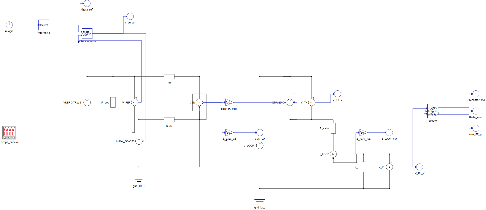

# TyphoonSim — Fase 1, Entrega 01 (cadeia ideal)

Potenciômetro Bourns 3590S (10 kΩ, 10 voltas) → buffer OPA333 → transmissor XTR115 (4–20 mA) →
laço de 24 V → receptor de 250 Ω.

O arquivo `modelo.tse` foi gerado e compilado por script (`../reprodutibilidade/monta_modelo.py`,
API do Schematic Editor). Para regerar do zero, rode esse script com o TyphoonSim aberto.

## Topologia

O modelo tem uma parte de sinal e dois circuitos elétricos separados, cada um com a sua terra.

**Sinal**

| Bloco | Tipo | Função |
|---|---|---|
| `relogio` | Clock (1 ms) | tempo de simulação |
| `referencia` | C function | varredura triangular θ_ref: 0 → 3600° em 10 s, 3600° → 0 em mais 10 s |
| `potenciometro` | C function | sensor ideal: `v_cursor = (θ/3600) · V(VREF)`, com `V(VREF)` medido no circuito (razão-métrico) |
| `XTR115_x100` | Gain (100) | espelho de corrente do XTR115: `Io = 100 · I_IN` |
| `receptor` | C function | `i_mA = 1000·V_RL/250`; `θ_med = 3600·(i_mA − 4)/16`; `erro_FE = 100·(i_mA − (4 + 16·θ_ref/3600))/16` |
| `A_para_uA`, `A_para_mA` | Gain | conversão de unidade para as sondas |

**Lado do sensor** (referido ao pino IRET do XTR115, terra `gnd_IRET`)

| Elemento | Valor | Representa |
|---|---|---|
| `VREF_XTR115` | 2,5 V (constante) | referência interna do XTR115 |
| `R_pot` | 10 kΩ | carga do potenciômetro sobre VREF (resistência total, entre VREF e IRET) |
| `V_REF` | medidor de tensão | lê VREF para o C function do potenciômetro |
| `buffer_OPA333` | fonte de tensão controlada por sinal | seguidor de tensão ideal: `v = v_cursor` |
| `R_IN` | 15,6 kΩ (E192) | resistor de span (ideal: 15,625 kΩ) |
| `R0` | 62,6 kΩ (E192) | resistor de zero, a partir de VREF (ideal: 62,5 kΩ) |
| `I_IN` | amperímetro | pino IIN: terra virtual (queda nula), mede `I_IN = v_cursor/R_IN + VREF/R0` |

**Laço** (terra `gnd_laco`)

| Elemento | Valor | Representa |
|---|---|---|
| `V_LOOP` | 24 V (constante) | fonte do laço |
| `XTR115_Io` | fonte de corrente controlada por sinal, `n_node` em V+ e `p_node` em IO | saída do transmissor |
| `V_TX` | medidor de tensão | tensão sobre o transmissor (tem que ficar ≥ 7,5 V) |
| `R_cabo` | 50 Ω | resistência de ida e volta do cabo (hipótese de projeto) |
| `I_LOOP` | amperímetro | corrente do laço |
| `R_L` | 250 Ω | resistor de carga do receptor (1–5 V) |
| `V_RL` | medidor de tensão | leitura do receptor |

Os dois circuitos elétricos são separados de propósito: no XTR115 real, o circuito do sensor
flutua referido ao pino IRET, e o transmissor regula a corrente de saída a partir da corrente
que entra em IIN. No modelo, essa ligação é feita pelo sinal `I_IN → ×100 → XTR115_Io`.

**Sondas / Scope** (`Scope_cadeia`): `theta_ref`, `theta_med`, `I_LOOP_mA`, `V_RL_V`,
`V_TX_V`, `I_IN_uA`, `v_cursor`, `erro_FE_pc`, `I_receptor_mA`.

**Solver:** TyphoonSim offline, DAE/BDF, passo máximo 1 ms, tolerâncias absoluta e relativa
de 1e-9, 20 s de simulação.

## Como executar

### Pela interface

1. Abra o TyphoonSim e, na tela inicial, abra o **Schematic Editor**. Não use o File → Open da
   janela principal: esse diálogo só lista `.tlib`.
2. File → Open → `modelo.tse`.
3. Compile e clique em **Start Simulation** (20 s de simulação).
4. No `Scope_cadeia`, confira: `theta_med` sobre `theta_ref`, `I_LOOP_mA` indo de ~4 a ~20 mA
   e voltando, `V_RL_V` entre 1 e 5 V, e `V_TX_V` acima de 7,5 V.
5. Tire a captura de tela (esquemático + Scope em execução) e salve como `captura-scada.png`
   nesta pasta.
6. Se o Scope permitir exportar os dados, salve o CSV como `dados/varredura_cabo_nominal.csv`,
   com uma coluna `Time` e as colunas com os nomes das sondas.

### Por script (gera os CSV em `dados/`)

Com o TyphoonSim aberto e **sem nenhuma outra simulação rodando** (só uma simulação por vez é
licenciada):

```powershell
& "C:\Users\Leonardo\Downloads\10.grupo\10.grupo\3.typhoonsim\.venv\Scripts\python.exe" ..\reprodutibilidade\roda_typhoon.py
python ..\reprodutibilidade\analisa_typhoon.py
```

O primeiro comando roda duas simulações: cabo nominal (50 Ω) e cabo longo (550 Ω, alterado só
em memória). O segundo comando gera as figuras e os números do relatório.

> **Atenção (Windows):** deixe o **Schematic Editor aberto** antes de rodar o script. Com só a
> janela principal do TyphoonSim aberta, a simulação iniciada pela API parou em
> "Simulation ready!" e o `TyphoonSim.exe` ficou ocioso (24/09 às 18:56, e também em 22/08). Com
> o Schematic Editor aberto, rodou normalmente (24/09 às 19:47, as duas simulações em segundos).
> Se travar, encerre o `TyphoonSim.exe` pelo Gerenciador de Tarefas.
> Só uma simulação pode rodar por vez: "license is not available" quer dizer que já tem outra
> simulação rodando.

**Atraso numérico:** os blocos de sinal rodam a cada 1 ms, e cada passagem sinal → circuito →
sinal soma uma amostra. `I_LOOP` fica 2 ms atrás de `theta_ref`, e as 2 primeiras amostras de
`I_LOOP` saem nulas. `analisa_typhoon.py` compensa isso (ver R4 do relatório).

### Ensaio do cabo longo pela interface

Troque `R_cabo` para 550 Ω e rode de novo. A corrente do laço não deve mudar, e `V_TX_V` desce
até ~8 V, ainda acima do mínimo de 7,5 V do XTR115.

## Resultado esperado (gabarito do projeto, Eq. 2 do relatório)

| θ | I_LOOP | V_RL |
|---|---|---|
| 0° | 3,9936 mA | 0,998 V |
| 1800° | 12,006 mA | 3,002 V |
| 3600° | 20,019 mA | 5,005 V |

## Captura de tela (esquemático + painel SCADA)


